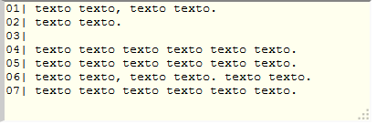
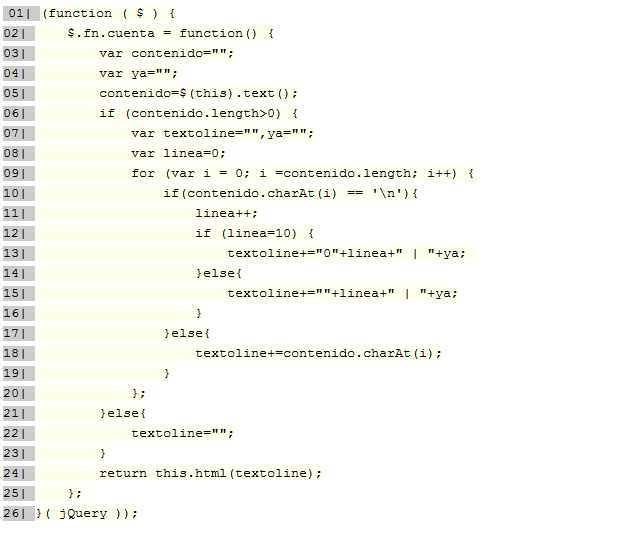

Cuenta línea (CuentaLineas.js)
============

Cuenta línea con Jquery : Plugin que cuenta y muestra el número de línea del texto que tiene un elemento en el DOM, puede ser usado en elementos como textarea, input text, div, code, section etc..

**Note**: Version 0.2.x .

Documentation
-------------
Es un plugin JQuery que es capaz de  contar el número de líneas de un elemento diferenciando el tipo de elementó del cual se trata, para poder mostrar el resultado dependiendo de este.

Diferencia entre un textarea y un div los cuales se comportan diferentes para mostrar un texto escritos en ellos.

Examples
--------
El primer ejemplo es sin indicar propiedades al plugin.

```html
<script type="text/javascript" src="http://code.jquery.com/jquery-1.11.0.min.js"></script>
<script type="text/javascript" src="jQuery.CuentaLinea.js"></script>
<link rel="stylesheet" type="text/css" href="stilo.css">
<script type="text/javascript">
$(document).on("ready",function(){
	$("#cuentaLi1").CuentaLineas();
});
</script>
</head>
<body>
	<textarea id="cuentaLi1">
		texto texto, texto texto.
		texto texto.
		
		texto texto texto texto texto texto.
		texto texto texto texto texto texto.
		texto texto, texto texto. texto texto.
		texto texto texto texto texto texto.
	</textarea>
</body>
```
Para indicar propiedades se puede hacer de la siguiente manera:
```javascript
$("#cuentaLi1").CuentaLineas({Nuwidth: 400,Nuheight: 130});
```
Para indicar otra class para salida se puede hacer así:
```javascript
$("#cuentaLi1").CuentaLineas({Nuwidth: 400,Nuheight: 130, classCL: "codigos"});
```



Veamos un ejemplo con una etiqueta `<code></code>`:

```html
	<script type="text/javascript" src="jQuery.CuentaLinea.js"></script>
	<link rel="stylesheet" type="text/css" href="stilo.css">
	<script type="text/javascript">
	$(document).on("ready",function(){
		$("#cuentaLi").CuentaLineas();
	});
	</script>
</head>
<body>
	<code id="cuentaLi" >
	(function ( $ ) {
		$.fn.cuenta = function() {
			var contenido="";
			var ya="";
			contenido=$(this).text();
			if (contenido.length>0) {
				var textoline="",ya="";
				var linea=0;
				for (var i = 0; i =contenido.length; i++) {
					if(contenido.charAt(i) == '\n'){
						linea++;
						if (linea=10) {
							textoline+="<br>0"+linea+" | "+ya; 
						}else{
							textoline+="<br>"+linea+" | "+ya;
						}
					}else{
						textoline+=contenido.charAt(i);
					}
				};
			}else{
				textoline="";
			}
			return this.html(textoline);
		};
	}( jQuery ));
	</code>
</body>
```

El resultado:



License
-------

Copyright (c) 2013-2014 nitsugario.
Released under the [MIT](LICENSE?raw=1) license.
